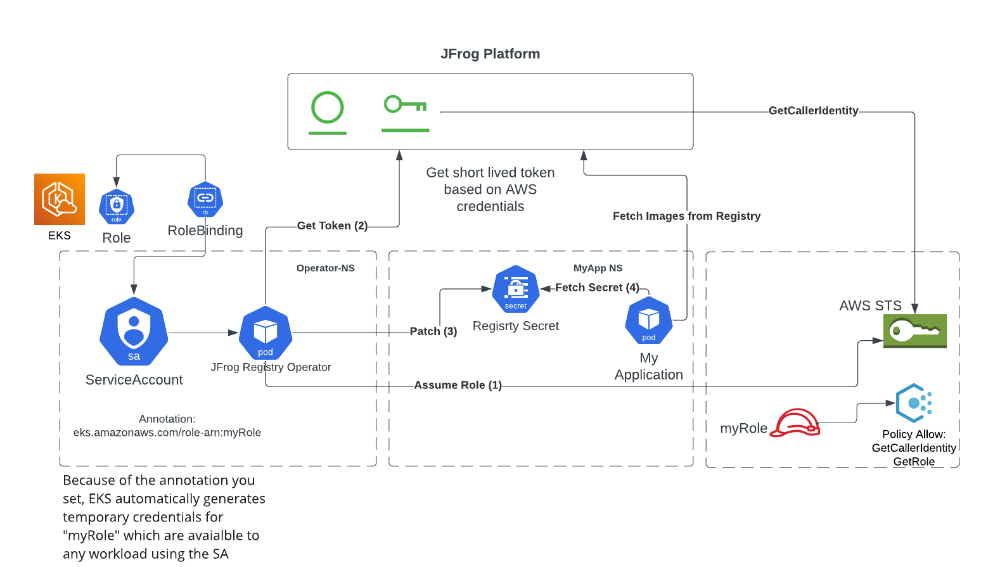

<div align="center">

# JFrog Registry Operator

[](#readme)

[](https://github.com/jfrog/jfrog-registry-operator#readme)
[](https://goreportcard.com/report/github.com/jfrog/jfrog-registry-operator)
[](https://github.com/jfrog/jfrog-registry-operator/actions/workflows/test.yml?branch=master)
[](https://github.com/jfrog/jfrog-registry-operator/issues)

</div>

## Setting up JFrog’s AssumeRole Capabilities in AWS

Follow the [official documentation](https://jfrog.com/help/r/jfrog-installation-setup-documentation/passwordless-access-for-amazon-eks) for detailed instructions on detailed information and AWS configuration required to run the JFrog Registry Operator.

The integration of AWS Assume Role and JFrog Access presents a powerful solution that enables AWS Identity and Access Management  (IAM) users to temporarily assume permissions to perform actions in a secure and controlled manner. The solution enhances Kubernetes Secrets Management by automating token rotation, enhancing access controls, and seamlessly integrating JFrog Artifactory into the AWS environment

### AssumeRole JFrog Architecture & Deployment

The following diagram shows the basic architecture of how AssumeRole integrates with JFrog Access to provide enhanced access control:



If you are interested in making the move from vulnerable manual secret handling to secure automated secret management, then your journey towards a more secure and seamless containerized future begins here. See how quickly this powerful capability can be deployed by checking out our step-by-step installation and configuration guide [Insert link to Step-by-Step Guide on the KB here ].


## Install operator using helm chart - Ignore if you already installed using Setting up JFrog’s AssumeRole Capabilities in AWS

```bash
# Get the latest [Helm release](https://github.com/helm/helm#install) Note: (only V3 is supported)
# before installing JFrog helm charts, you need to add the [JFrog helm repository](https://charts.jfrog.io) to your helm client.
helm repo add jfrog https://charts.jfrog.io

# update the helm repo
helm repo update

# decide on the namespace and kubernetes service account name you will want to create
export SERVICE_ACCOUNT_NAME="<service account name>"
export ANNOTATIONS="<Role annotation for service account>" # Example: eks.amazonaws.com/role-arn: arn:aws:iam::000000000000:role/jfrog-operator-role
export NAMESPACE="jfrog-operator"

# install JFrog secret rotator operator
helm upgrade --install secretrotator jfrog/jfrog-registry-operator --set "serviceAccount.name=${SERVICE_ACCOUNT_NAME}" --set serviceAccount.annotations=${ANNOTATIONS}  -n ${NAMESPACE}
```

Once operator is in running state, configure `artifactoryUrl`, `refreshTime`, `namespaceSelector`, and `secretMetadata` in [secretrotator.yaml](https://github.com/jfrog/jfrog-registry-operator/blob/master/charts/jfrog-registry-operator/examples/secretrotator.yaml)

Sample Manifest:

```
apiVersion: apps.jfrog.com/v1alpha1
kind: SecretRotator
metadata:
  labels:
    app.kubernetes.io/name: secretrotators.apps.jfrog.com
    app.kubernetes.io/instance: secretrotator
    app.kubernetes.io/created-by: artifactory-secrets-rotator
  name: secretrotator
spec:
  namespaceSelector:
    matchLabels:
      kubernetes.io/metadata.name: jfrog-operator
  secretName: token-secret
  artifactoryUrl: ""
  refreshTime: 30m
  secretMetadata:
    annotations:
      annotationKey: annotationValue
    labels:
      labelName: labelValue
```

Apply the secretrotator mainfest:

```
kubectl apply -f /charts/jfrog-registry-operator/examples/secretrotator.yaml -n ${NAMESPACE}
```

### Uninstalling JFrog Secret Rotator operator

```shell
# uninstall secretrotator using the following command
helm uninstall secretrotator -n ${NAMESPACE}

# uninstall secretrotator object (path should be pointing to secretrotator CR yaml)
kubectl delete -f [secretrotator.yaml](https://github.com/jfrog/jfrog-registry-operator/blob/master/charts/jfrog-registry-operator/examples/secretrotator.yaml) -n ${NAMESPACE}

# remove CRD from cluster
kubectl delete crd secretrotators.apps.jfrog.com
```

### Check Resources in your cluster

```shell
# For secrets in your namespace
kubectl get secrets -n ${NAMESPACE}

# For operator pod in your namespace
kubectl get po -n ${NAMESPACE}

# For SecretRotator
kubectl get SecretRotator
```

## 🤖 Monitoring operator

Follow [monitoring setup docs](./config/monitoring/).

## 🔥 Reporting issues

Please help us improve Frogbot by [reporting issues](https://github.com/jfrog/jfrog-registry-operator/issues/new/choose) you encounter.

<div id="contributions"></div>

## 💻 Contributions

We welcome pull requests from the community. To help us improve this project, please read our [Contribution](./CONTRIBUTING.md#-guidelines) guide.
